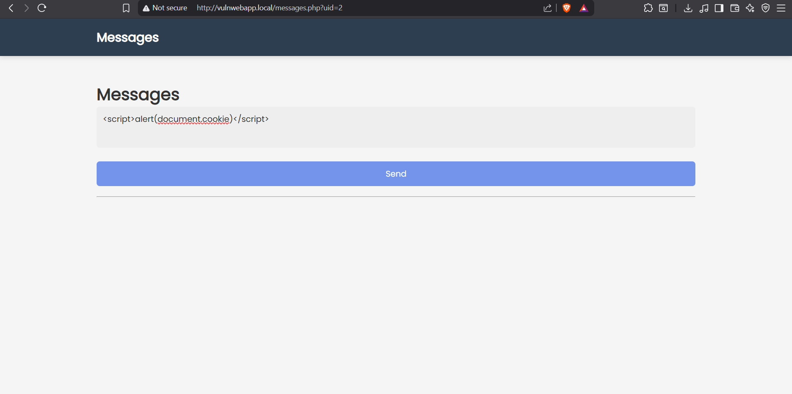
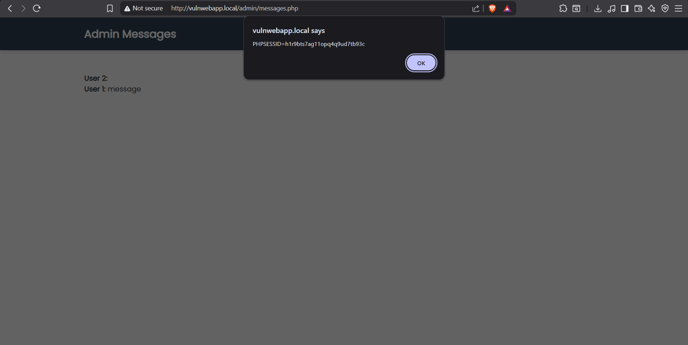
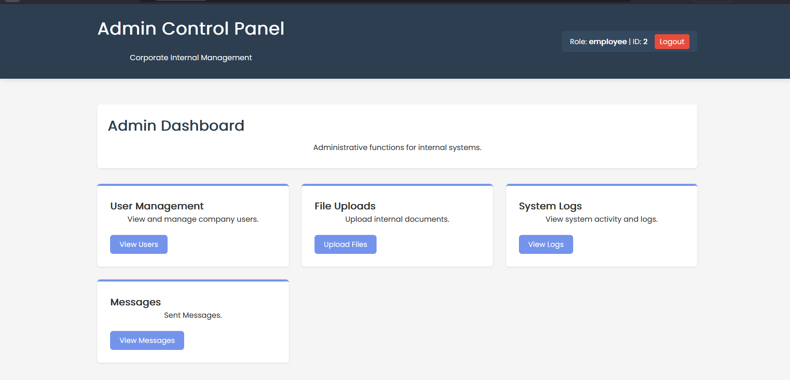
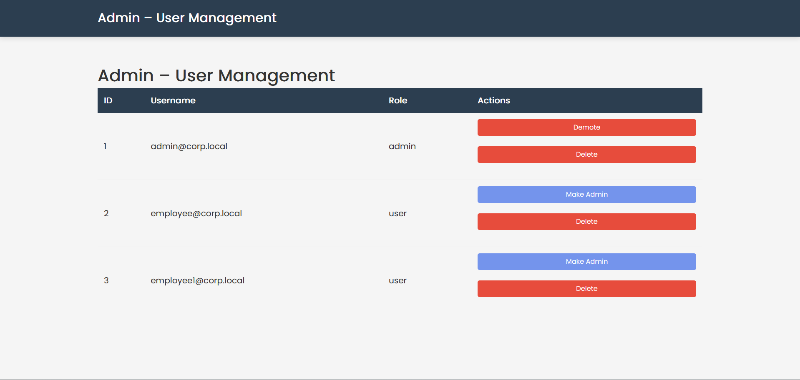
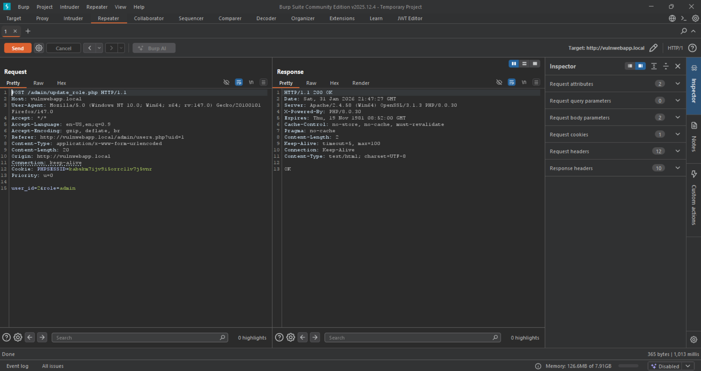
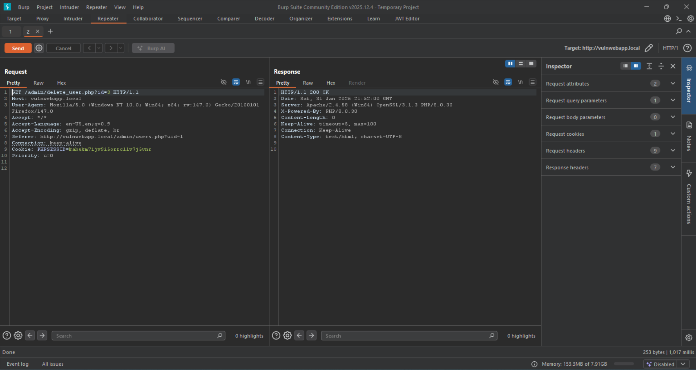
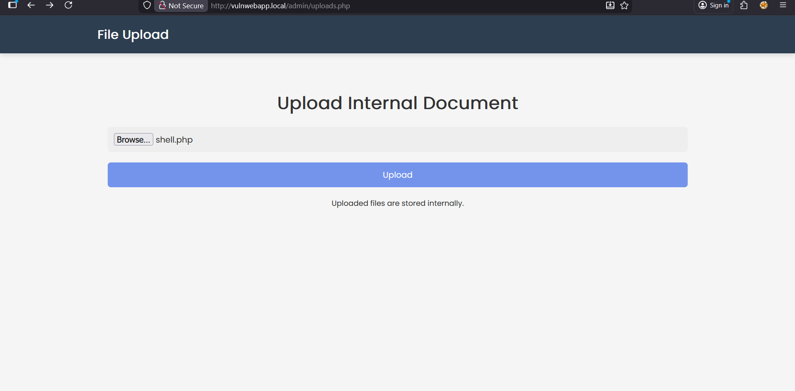
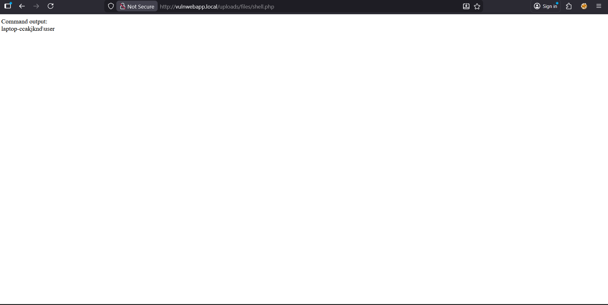

# Vulnerable Web Application – Penetration Test Report

---

## Executive Summary

### Overview
A penetration test was conducted against the **Vulnerable Web Application**, a deliberately vulnerable PHP-based web application designed for security testing and learning purposes. The objective of the assessment was to identify security weaknesses, demonstrate realistic attack paths through vulnerability chaining, and provide actionable remediation guidance.
Certain insecure configurations were intentionally enabled to demonstrate realistic exploitation impact in a controlled environment.

Testing focused on authentication, authorization, input handling, file management, and administrative functionality. The assessment was performed from the perspective of a low-privileged or unauthenticated attacker.

### Results
The assessment identified multiple high- and medium-risk vulnerabilities, including:
- Stored Cross-Site Scripting (XSS)
- Privilege Escalation due to Broken Access Control
- Unrestricted File Upload leading to Remote Code Execution
- Missing Authorization Checks on Administrative Actions

Individually, some issues appeared moderate in severity. However, when chained together, they resulted in **full administrative compromise of the application**.

### Impact
A real-world attacker could escalate from a low-privileged user to full administrative control, upload a server-side executable file and execute arbitrary commands on the hosting server. This could result in:
- Complete application compromise
- Theft or manipulation of sensitive data
- Persistent backdoor access

### Remediation Direction
Immediate remediation is required. Priority should be given to:
- Enforcing server-side authorization checks
- Securing file upload functionality
- Properly sanitizing and encoding user input

---

## Attack Chain Overview (Chaining Exploits)

The following attack chain was successfully demonstrated:

1. Attacker registers or accesses a low-privileged user account
2. Stored XSS is injected into user-generated content
3. Administrator views the malicious content
4. Admin session is abused to perform privileged actions
5. Privilege escalation is achieved
6. Unrestricted file upload is abused to upload a web shell
7. Remote code execution is obtained

This chain demonstrates how **multiple lower-level vulnerabilities combine into a critical business risk**.

---

## Findings & Recommendations

---

### Finding 1: Stored Cross-Site Scripting (XSS) in User Messages

**Risk Rating:** Medium

**Summary:**
A stored Cross-Site Scripting vulnerability was identified in the user messaging functionality. User-supplied input is stored and later rendered without proper output encoding.

**Background:**
Stored XSS occurs when untrusted input is persisted on the server and executed in another user’s browser. This is particularly dangerous when administrative users are affected.

**Technical Details & Evidence:**
The vulnerability was identified in the message submission feature.

Payload used:
```html
<script>alert(document.cookie)</script>
```

The payload was stored in the database and executed when viewed by another user.

**Screenshot:**
Screenshot of message submission with from an employee's account

Screenshot of alert executing when admin views messages


**Impact:**
An attacker could execute arbitrary JavaScript in the context of an administrator, leading to session hijacking or unauthorized administrative actions.

**Remediation Advice:**
- Apply output encoding (e.g. `htmlspecialchars()` in PHP)
- Implement a Content Security Policy (CSP)

---

### Finding 2: Broken Access Control – Privilege Escalation

**Risk Rating:** High

**Summary:**
A low-privileged user was able to escalate privileges by manipulating role-related parameters without proper server-side authorization checks.

**Background:**
Broken access control occurs when applications fail to enforce permissions on the server, relying instead on client-side checks.

**Technical Details & Evidence:**
The role modification endpoint did not validate whether the requesting user had administrative privileges.

By modifying the request:
```
role=admin
```
The user account was upgraded to administrator.

**Screenshot:**
Low‑privileged employee account (uid=2) accessing the administrative dashboard via an Insecure Direct Object Reference (IDOR).

User management interface accessible to a non‑admin user, exposing privileged functionality.

Burp Suite interception of the role update request. The user_id parameter was modified to promote the attacker’s own account (uid=2) to administrator, demonstrating missing server‑side authorization checks.


**Impact:**
An attacker can gain full administrative access, allowing full control over users and application functionality.

**Remediation Advice:**
- Enforce role checks server-side
- Implement centralized authorization middleware

---

### Finding 3: Missing Authorization on Administrative Actions

**Risk Rating:** High

**Summary:**
Critical administrative actions such as user deletion were accessible without proper authorization checks.

**Technical Details & Evidence:**
Requests to administrative endpoints succeeded when performed by unauthorized users.

📸 **Screenshot:**
Request to delete user from non-admin account


**Impact:**
Unauthorized users can disrupt application integrity by deleting or modifying accounts.

**Remediation Advice:**
- Restrict admin endpoints to authorized roles only

---

### Finding 4: Unrestricted File Upload Leading to Remote Code Execution

**Risk Rating:** Critical

**Summary:**
The application allows unrestricted file uploads without validating file type or execution permissions, allowing PHP files to be uploaded and executed.

**Background:**
Unrestricted file uploads are a common path to full server compromise.

**Technical Details & Evidence:**
An arbitrary PHP file containing server-side executable code was uploaded via the file upload functionality:
```php
<?php system($_GET['cmd']); ?>
```

The file was accessible and executed via the browser.

**Screenshot:**
Upload form with PHP file

Browser executing system command


**Impact:**
An attacker can execute arbitrary commands on the server, leading to complete compromise.

Because file type and execution context were not restricted, any server-side script supported by the environment could be uploaded and executed.

**Remediation Advice:**
- Restrict allowed file types
- Store uploads outside the web root
- Disable PHP execution in upload directories

---

## Methodology

- Manual testing
- Burp Suite
- Browser-based testing
- Source code review

---

## Scope

**In Scope:**
- Authentication
- Authorization
- File upload
- User-generated content

**Out of Scope:**
- Infrastructure-level testing

---

## Appendices

### Assessment Artefacts
- Uploaded web shell: `/uploads/files/shell.php`
- Test user accounts

---

## Conclusion

The application was found to be vulnerable to multiple security issues that, when chained together, resulted in full administrative and server compromise. Immediate remediation is strongly recommended before any production deployment.

